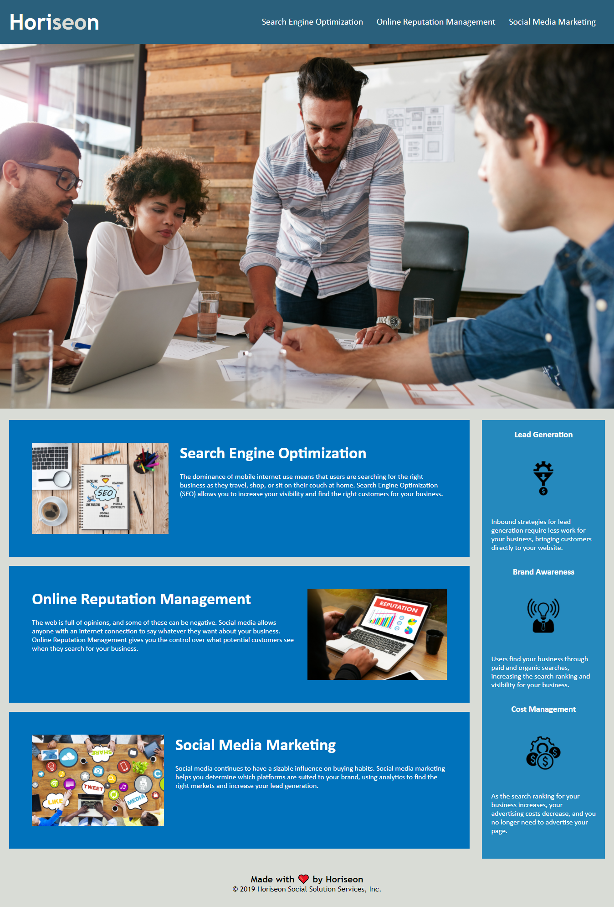

# Homework1
### Changes made to html and css

## The project was to clean up this websites html and css outdated code to allow for more accessability and functionality.

* Updated websites title to "Horiseon".

* Fixed broken link leading to "Search-Engine-Optimization".

* Included semanic HTML5 elements to to reduce clustered div tags and make the html more accessible.

* Added comments where they were needed in the html.

* Eliminated duplicate classes with different names, as well as consolidated css.

* fixed head to follow semantic structure.

* Added comments to the css file to further explain functions.

* Rearranged and organized css classes in css file to follow semantic structure.

## Screen shot of website in full functioning order

## Links
